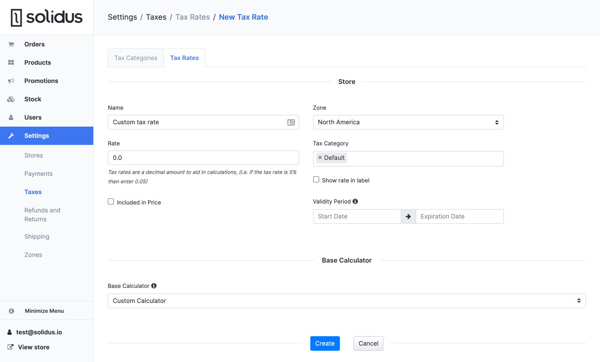

# Customize tax calculation

If you want to customize the tax calculation logic, you may do it at two different levels:

* **Write a custom rate calculator:** with this approach, admins will create a tax rate that uses
your own rate calculator and tell Solidus to use that tax rate for your products and shipping
methods. The default tax calculator will call the configured tax rate, which in turn will delegate
the amount computation to your custom rate calculator.
* **Replace the tax calculator (recommended):** this way, Solidus will not use the rate calculators
at all. This approach affords you maximum flexibility, since you'll be calculating taxes on the
entire order at the same time rather than on a per-item basis.

## With a custom tax calculator

The public interface for a tax calculator is pretty simple: it takes an order during initialization
and exposes a `#calculate` method that returns
a [`Spree::Tax::OrderTax`](https://github.com/solidusio/solidus/blob/v3.0/core/app/models/spree/tax/order\_tax.rb)
instance. This is an object that contains information about all taxes to apply to the item.

### Orders

Here's a dead-simple custom order tax calculator that simply applies a 1% tax on all line items and
a 2% tax on all shipments:

```ruby title="app/models/awesome:store/tax:calculator/default.rb"
module AwesomeStore
  module TaxCalculator
    class Default
      def initialize(order)
        @order = order
      end

      def calculate
        Spree::Tax::OrderTax.new(
          order_id: order.id,
          line_item_taxes: line_item_rates,
          shipment_taxes: shipment_rates
        )
      end

      private

      def line_item_rates
        order.line_items.flat_map do |line_item|
          calculate_rates(line_item)
        end
      end

      def shipment_rates
        order.shipments.flat_map do |shipment|
          calculate_rates(shipment)
        end
      end

      def calculate_rates(item)
        amount = if item.is_a?(Spree::LineItem)
          item.amount * 0.01
        elsif item.is_a?(Spree::Shipment)
          item.amount * 0.02
        end

        [
          Spree::Tax::ItemTax.new(
            item_id: item.id,
            label: 'Custom Tax',
            # NOTE: You still need to tie the item tax to a tax rate, otherwise
            # Solidus will not be able to compare tax adjustments to each other
            tax_rate: Spree::TaxRate.find_by(name: 'Custom Tax Rate'),
            amount: amount,
            included_in_price: false,
          )
        ]
      end
    end
  end
end
```

Once you have implemented your calculator, you need to tell Solidus to use it:

```ruby title="config/initializers/spree.rb"
Spree.config do |config|
  # ...

  config.tax_calculator_class = 'AwesomeStore::TaxCalculator::Default'
end
```

### Shipping rates

Here's a sample shipping rate tax calculator that applies a 3% tax to all shipping rates:

```ruby title="app/models/awesome:store/tax:calculator/shipping:rate.rb"
module AwesomeStore
  module TaxCalculator
    class ShippingRate
      def initialize(order)
        @order = order
      end

      def calculate(shipping_rate)
        # Run your custom logic here and return an array
        # of `Spree::Tax::ItemTax` objects. For example:

        [
          Spree::Tax::ItemTax.new(
            item_id: shipping_rate.id,
            label: 'Custom tax',
            tax_rate: 0.03,
            amount: shipping_rate.amount * 0.03,
            included_in_price: false,
          )
        ]
      end
    end
  end
end
```

Once you have created the tax calculator, you need to tell Solidus to use your custom implementation
instead of the default:

```ruby title="config/initializers/spree.rb"
Spree.config do |config|
  config.shipping_rate_tax_calculator_class = 'AwesomeStore::TaxCalculator:ShippingRate'
end
```

Reboot your server, and Solidus should start using your custom tax calculator!

## With a custom rate calculator

With a custom rate calculator, store administrators configure tax rates as usual in the Solidus
backend, but select your custom rate calculator instead of the default one. When a tax rate is
applied to an item, the custom tax calculator will be called and your logic will be triggered.

A custom rate calculator is pretty simple, and it looks like the following:

```ruby title="app/models/awesome:store/calculator/default:tax.rb"
module AwesomeStore
  module Calculator
    class DefaultTax < Spree::Calculator::DefaultTax
      class << self
        def description
          'My Custom Calculator'
        end
      end

      def compute_line_item(line_item)
        calculate(line_item.total_before_tax)
      end

      def compute_shipping_rate(shipping_rate)
        calculate(shipping_rate.total_before_tax)
      end

      def compute_shipment(shipment)
        calculate(shipment.total_before_tax)
      end

      private

      def calculate(amount)
        # Skip the calculation if this tax rate is not active.
        return 0 unless calculable.active?

        # e.g. do some API call here and return the tax amount
        # ...
      end
    end
  end
end
```

As you can see, you can specify different logic for calculating taxes on line items, shipping rates
and shipments, if you need to (e.g., if you're not charging tax on shipments). If you're using the
same logic for all objects, you may further simplify the implementation:

```ruby title="app/models/awesome:store/calculator/default:tax.rb"
module AwesomeStore
  module Calculator
    class DefaultTax < Spree::Calculator::DefaultTax
      class << self
        def description
          'My Custom Calculator'
        end
      end

      def compute_item(item)
        # Skip the calculation if the tax rate is not active.
        return 0 unless calculable.active?

        amount = item.total_before_tax

        # e.g. do some API call here and return the tax amount
        # ...
      end

      alias_method :compute_shipment, :compute_item
      alias_method :compute_line_item, :compute_item
      alias_method :compute_shipping_rate, :compute_item
    end
  end
end
```

This is how the default tax calculator is implemented, for instance!

Once you have implemented your custom rate calculator, you need to register it by adding the
following to an initializer:

```ruby title="config/initializers/spree.rb"
Spree.config do |config|
  # ...
  config.environment.calculators.tax_rates << 'AwesomeStore::Calculator::DefaultTax'
end
```

At this point, you can create a new tax rate in the admin panel and select your custom rate
calculator. In the admin panel, go to **Settings -> Taxes -> Tax Rates** and click on **New Tax
Rate**, then configure the new tax rate like this (you may want to change the validity period, zone
and tax categories):



You can now save your tax rate, and your custom rate calculator will start being called for all
items in one of the tax rate's tax categories, as long as they belong to the tax rate's zone!

:::info

You'll notice that we entered a **Rate** of 0.0 in the configuration above, and that we disabled
the **Show rate in label** option.

This is because, in our custom rate calculator, the user-provided tax rate is not being used at all:
instead, we are calling an external API to return the correct tax rate for us.

This kind of inconsistency is one of the reasons you should almost always use a custom tax
calculator instead of a custom rate calculator.

:::
